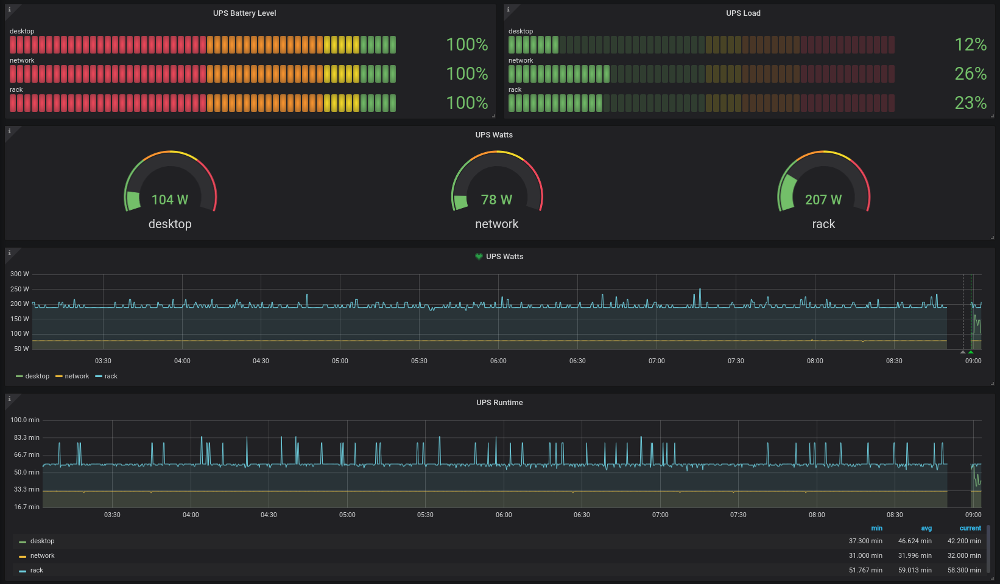

# rail

Prometheus exporter for `nut` connected UPS devices.



## Command

UPS are added in the following format.  `<name>:<hostname>:<ups watts>`.

```bash
> rail --ups rack:10.0.10.10:900 --metrics :9930 --ups network:wireguard.compute:300 --ups desktop:babylake.compute:865
```
## Metrics

```
# HELP crosbymichael_rail_battery_runtime_seconds Battery Runtime
# TYPE crosbymichael_rail_battery_runtime_seconds gauge
crosbymichael_rail_battery_runtime_seconds{name="desktop"} 2.238e+12
crosbymichael_rail_battery_runtime_seconds{name="network"} 1.92e+12
crosbymichael_rail_battery_runtime_seconds{name="rack"} 3.498e+12
# HELP crosbymichael_rail_charge_percent Battery Charge
# TYPE crosbymichael_rail_charge_percent gauge
crosbymichael_rail_charge_percent{name="desktop"} 100
crosbymichael_rail_charge_percent{name="network"} 100
crosbymichael_rail_charge_percent{name="rack"} 100
# HELP crosbymichael_rail_load_percent UPS load
# TYPE crosbymichael_rail_load_percent gauge
crosbymichael_rail_load_percent{name="desktop"} 18
crosbymichael_rail_load_percent{name="network"} 26
crosbymichael_rail_load_percent{name="rack"} 21
# HELP crosbymichael_rail_output_voltage_volts UPS output voltage
# TYPE crosbymichael_rail_output_voltage_volts gauge
crosbymichael_rail_output_voltage_volts{name="desktop"} 0
crosbymichael_rail_output_voltage_volts{name="network"} 123
crosbymichael_rail_output_voltage_volts{name="rack"} 122
# HELP crosbymichael_rail_status_total UPS Status
# TYPE crosbymichael_rail_status_total gauge
crosbymichael_rail_status_total{name="desktop",status="OL"} 1
crosbymichael_rail_status_total{name="network",status="OL"} 1
crosbymichael_rail_status_total{name="rack",status="OL"} 1
# HELP crosbymichael_rail_watts_total UPS Watts
# TYPE crosbymichael_rail_watts_total gauge
crosbymichael_rail_watts_total{name="desktop"} 865
crosbymichael_rail_watts_total{name="network"} 300
crosbymichael_rail_watts_total{name="rack"} 900
```
